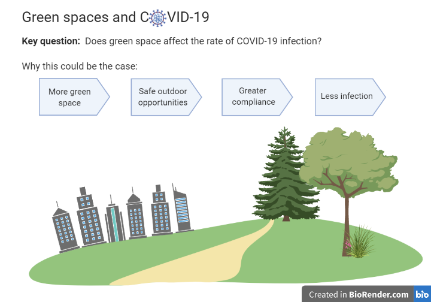
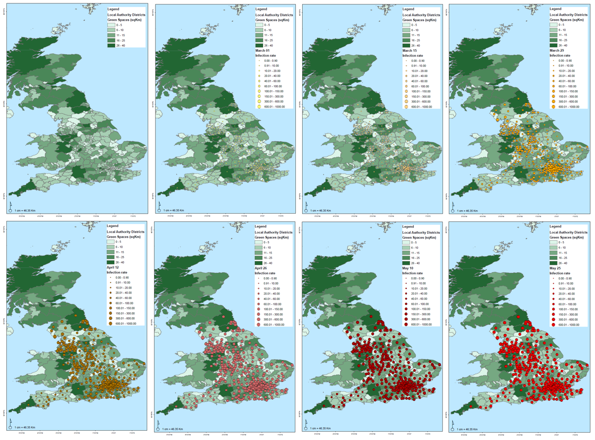
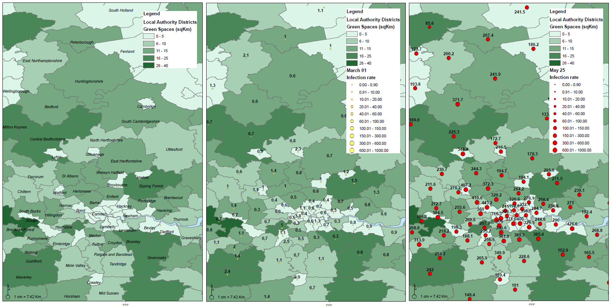
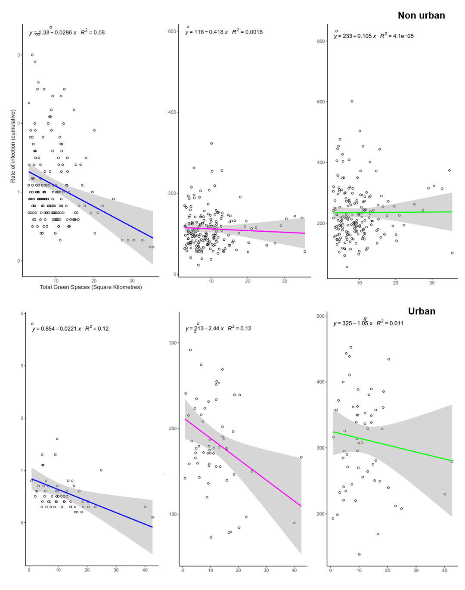
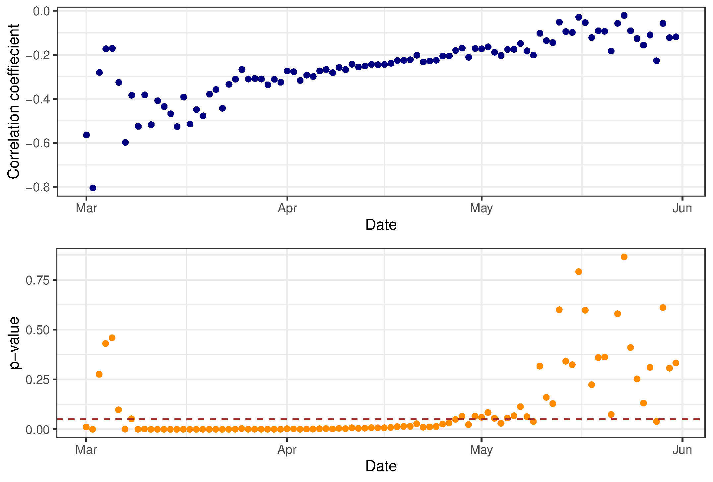
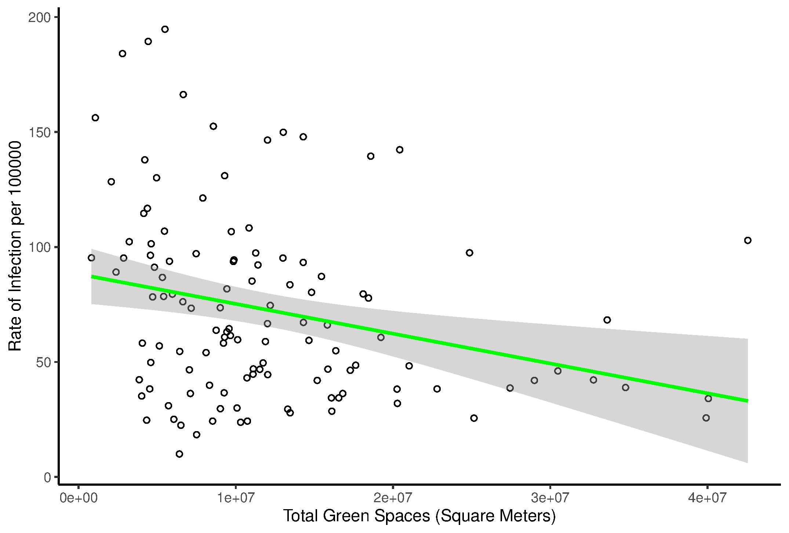

# 2FRESH2FURIOUS_NERCHackathonThree_EcosytemServices
This repository is 2FRESH2FURIOUS's entry to NERC's [COVID-19 Hackathon 3: Ecosystem Services](https://digitalenvironment.org/home/covid-19-digital-sprint-hackathons/covid-19-hackathon-3-ecosystem-services/). COVID-19 Hackathon 3: Ecosystem Services, organised by the Natural Environment Research Council on behalf of the UKRI. 

# Executive Summary 

# The brief

- Can we understand whether/how a healthy natural environment modulates the spread of COVID-19? And whether changed human behaviours are having an impact on this? Can we use this insight to improve health outcomes? 
- Evidence-based support for decision-makers and individuals to mitigate their environmental impact and reduce their personal health risk. 

Can we understand from landscape structure and function, the impact of natural capital and ecosystem services on how a healthy natural environment modulates the spread of COVID-19, and what benefits we obtain from this that may lead to better COVID-19 related health outcomes? For instance, do diverse ecosystems suppress disease outbreaks?  What characteristics of the natural environment modulates the disease dynamics? Is there evidence that exposure to nature/biodiversity lead to better health outcomes? How can we provide evidence-based support for individuals to allow them to mitigate their environmental impact and also reduce their personal health risk at the same time? 

# The Report

## Introduction
Complex interactions between humans, animals and the environment play a critical role in the appearance of new viruses.  Approximately 75% of emerging pathogens are zoonotic and exposure to these diseases is amplified via overexploitation of ecosystem services to the point of one new infectious human disease every four months (Everard et al., 2020). UNEP (2020) concluded that exponential population growth and decline in biodiversity and ecosystems has increased opportunities for pathogen transmission. 

Coronavirus, a member of the Coronaviridae family is one of the primary pathogens targeting the human respiratory system (Rothan & Byrareddy 2020). Symptoms range from that of the common cold, to lethal respiratory syndromes (Carducci et al., 2020). In the last 18 years, coronaviruses have caused three major outbreaks: Severe acute respiratory syndrome (SARS), Middle East respiratory syndrome (MERS), and coronavirus disease 2019 (COVID-19). In December 2019, a cluster of patients were epidemiologically linked to a wet animal and seafood wholesale market in Wuhan, Hubei Province, China and symptoms were described to the WHO as “pneumonia with unknown aetiology” (Rothan & Byrareddy 2020).  The virus (later named SARS-CoV2) began to spread globally through human-to-human transmission and on the 11th March 2020, the WHO declared COVID-19 a global pandemic. As of the 30th of June 2020, there were 10,471,015 cases and 509,742 deaths (https://www.worldometers.info/coronavirus/).  

Global efforts to contain the spread of COVID-19 include strict quarantines, social distancing measures and enforcements, travel bans and restrictions, and closure of workplaces, schools, shops and other public places. These measures inadvertently produced some temporary environmental benefits including a reduction in consumption and transport, equating to a four to seven percent decline in annual global carbon dioxide emissions (Le Queré et al 2020). Moving forward in a post COVID-19 world it is critical to recognise the value of ecosystems and their services on a global and local scale. These unprecedented circumstances present a unique opportunity to understand the value of ecosystems in “lockdown” conditions. Healthy ecosystems regulate disease transfer, provide clean air and water whilst simultaneously improving wellbeing (Fisher et al., 2009).

### Health and wellbeing associated with green and blue spaces  
The population of the UK are increasingly inhabiting towns and cities, with over 80% of the population currently living in urban areas (DEFRA, 2020). However, nearly a third (31%) of the urban extent in the UK is urban “green space” (ONS 2018). Green spaces include areas of natural land cover, such as parks, cemeteries, sports fields, golf courses and nature reserves. They may be accessible to all or restricted access, but the term does not generally include private gardens.  These areas provide a variety of ecosystem services, such as removal of air pollution, flood protection and physical and mental health benefits (Jennings & Gaither, 2015; Niemelä et al., 2010). 

Mental and physical health benefits from green spaces have been widely reported (Lee et al., 2015; Maller et al., 2005; Maund et al., 2019; Nutsford et al., 2016; Romagosa, Eagles & Lemieux, 2015). These are driven by the availability of space for physical activities, social interaction, connection to nature and the promotion of mental relaxation (Irvine et al., 2013; Lee et al., 2015; Nutsford et al., 2016; Sugiyama et al., 2008; Völker & Kistemann, 2013; White et al., 2013). For example, in some instances green space availability and accessibility is seen to lead to increased physical activity levels (Coombes, Jones & Hillsdon, 2010; Lachowycz et al., 2012; White et al., 2018). Environmental quality has also been seen to be associated with psychological restoration associated with green spaces, suggesting that higher value areas for nature are more beneficial for human wellbeing (Ratcliffe, Gatersleben & Sowden, 2013; Wyles et al., 2017). 

### COVID-19 and green spaces  
This interaction between green spaces with health in the context of a pandemic is particularly stark, both from a health and wellbeing perspective. For example, there evidence suggests the presence of green space reduces the prevalence of obesity in the population (Lachowycz & Jones, 2011). Considering that conditions such as obesity have been seen to contribute to increased COVID-19 hospital admissions and mortality there could be some cause to argue the value for green spaces has increased due to COVID-19 (Docherty et al., 2020; Sattar et al., 2020).   

Green space availability takes on more importance for urban dwellers, those from ethnic minorities and lower socioeconomic status. One in eight British households does not have access to a private garden, and this proportion rises to one in five if you live in London, and one in three if you are Black (ONS 2020). However, 72% of the UK population have access to a public park within a fifteen-minute walk, and parks are more accessible in poorer areas (ONS 2020).  
 
When social distancing is considered, the importance of availability of these spaces is heightened. For example, if each urban resident was to visit their nearest park for an hour across an 8-hour window, 89% parks could have the potential to facilitate safe social distancing (Shoari et al., 2020). In some areas, increased use of green spaces has been recorded throughout the pandemic, which has the potential to add pressure on these areas (Venter et al., 2020). Managing the increased necessity for green spaces for public use, combined with the need for social distancing has led to difficult decisions for land managers and policy makers, with park closures seen in some areas (Freeman & Eykelbosh, 2020).   

Social distancing measures in place to slow COVID-19 transmission have the potential to impact public health and wellbeing (Pfefferbaum & North, 2020; Torales et al., 2020). For example, social isolation due to social distancing could promote symptoms such as of post-traumatic stress (Brooks et al., 2020). Green spaces provide opportunities for people to spend time outdoors, connect with nature, exercise and socialise, potentially mitigating in part the mental and physical tolls of lockdowns.  The positive effects on well-being while allowing for social distancing highlight the importance of these spaces, both during the current period and into the future (Samuelsson et al., 2020). Here we hypothesise that areas in the UK with more green space have lower rates of Covid-19 infection because areas with more green space provide opportunities to spend time safely outdoors, potentially leading to more compliance with lockdowns and social distancing guidance.   

## Methods
### GIS
Regional COVID-19 infection rate and cases data was obtained from the UK Government Coronavirus dashboard, as was regional location and boundary data. These two dataframes were merged, and then filtered to include only lower-tier local authorities to prevent pseudoreplication. This dataframe was then separated into multiple dataframes corresponding to two-week periods between 1st of March and the end of May, with only the regional rate for the earliest date for each location retained. Polygon shapefiles for lower-tier local authorities were also obtained from the UK Government’s website.  

Area of green spaces (both public and private – Ordinance Survey) available to the general public was calculated within each local authority with ArcGIS (ESRI). The green spaces polygons within dataset were dissolved by function (e.g. public park, allotments, play area etc) across England, and subsequently used to calculate the areas of intersect between the green spaces and local authorities. Maps were created where shades of green represented the total area (sqKm) of green spaces within a local authority boundary and these were layered with COVID-19 infection rates through time. 

### Statistical Analysis
We obtained data on the cumulative COVID-19 infection rate per 10,000 people at the local authority level published on 29th June 2020 from the UK government website. Data for the number of people per square kilometre (population density) and the median Index of Multiple Deprivation (IMD) for local authorities for 2019 was obtained from the Office of National Statistics (ONS) website  Finally, and total area in of green space per lower tier local authority (square kilometres) was obtained from OS Greenspace Ordnance Survey dataset, and the ArcGIS analysis (see above). Fully accessible (e.g. public parks) and restricted access (e.g. golf courses, playing fields) green spaces were combined into a single variable. 

Data analysis took place in R (R Core Team, 2018). In order to investigate how the relationship between total green space and rate of infection varied throughout the lockdown period, all datasets were first merged into one data frame and then the correlation between total green space and infection rate was calculated for each date between 1st March 2020 – 1st June 2020. Figure 3 shows how the Pearson correlation coefficient and significance (p-value) changes through time. It was found that during the lockdown period between mid-March and May, significant negative correlations were observed, in which the greater the amount of green space available in a region, the lower the rate of COVID-19 infection. As lockdown began to ease (early May) it was found that the correlation became weaker and not significant.  

There are several factors which may interact with the amount of total green space in a region, and separately which may influence the rate of COVID-19 infection, such as population density and level of deprivation. In order to determine whether the rate of COVID-19 infection is significantly affected by total green space when other factors such as deprivation (Index of Multiple Deprivation, IMD) and population density are considered, linear models were produced using data from one-time frame in the middle of lockdown. A single datapoint was retained per location for the 1st of April (mid lockdown), or where lacking, the closest date before this. Comparisons between linear models, with infection rate as a response variable and total green space area, IMD and population density as explanatory variables, demonstrated that total green space had a significant negative effect on the infection rate when also considering the effects of population density and IMD (F(1, 115) = 33.901, P < 0.0001)(Figure 4). 

### Results

Figure 1.1: Green spaces area (sqKm) within English local authorities and COVID-19 infection rate for 100,000 inhabitants, from the 1st of March till 25th of May 2020.

Figure 1.2: Green spaces in Greater London and infection rate (for 100,000 inhabitants) comparison from the 1st of March and the 25th of May 2020.

Figure 2: Infection rates in urban and non-urban geographies for three dates, 01.03.2020 (blue), 12.04.2020 (magenta) and 25.05.2020 (green). Non urban is classified as geographies outside metropolitan districts, urban is classified as data coming from metropolitan districts, the London metropolitan district has been further subdivided into London boroughs. Coloured lines represent linear regressions. Of the urban data (bottom row), both pre-lockdown infection rates (01.03.2020; blue; F(1,57) = 7.484,	p = 0.008284*, R2= 0.1006) and during stringent lockdown rates (magenta, 12.04.2020; F(1,57) = 7.745, 		p = 0.007291*, R2= 0.1042) showed a significant decline with increase of available green spaces. The same was not found after lockdown was relaxed (25.05.2020; green; F(1,57) = 0.6282, p = 0.4313, R2= -0.006452). Of the non urban data (top row) only 01.03.2020 was significant (blue; F(1, 183) = 15.98, p < 0.000*, R2= 0.07527), the other two showed no correlation, 12.04.2020 (magenta; F(1,183) = 0.3332, p = 0.5645, R2= -0.003637) and 15.05.2020 (green; F(1,183) = 0.007497, p = 0.9311, R2= -0.005423). A Bonferroni correction was applied.

Figure 3: Pearson correlation coefficients between total green space and the cumulative COVID-19 infection rate per 10,000 people at the local authority level between March-May 2020. P. values represent the significance of each correlation coefficient, with those below 0.05 (dashed lined) being significant

Figure 4: The relationship between total green space and rate of COVID-19 infection at the local authority level for the beginning of April 2020

## Discussion

Clearly, green spaces are important for physical and mental health and general wellbeing during and outside of lockdown, but our analysis suggests that access to green space is also related to lower rates of infection with SARS-CoV2.  

As our data illustrates, infection rates were lower in local authority regions with a larger total area of green space in the region, and this relationship was significant between Mid-March 2020 and the beginning of May 2020 (Fig 3). This finding suggests that the amount of green space in an area plays a key role in modulating the rate of Covid-19 infection when people are unable to travel outside their local area. This could be because the presence of green space made it easier to observe social distancing regulations of 2m+ when leaving the house to exercise, or possibly because higher green space lead to increased wellbeing and more acceptance of lockdown conditions in all areas of life. The weakening of the relationship from May onwards may be the result of easing lockdown regulations, meaning people were able to travel further from their homes and access green space that was not available in their close vicinity. In the middle of the lockdown period (1st April 2020), the negative correlation was stronger in more urban areas (cities and London boroughs) than other local authority areas (Fig 4). 

However, being a ‘rough and ready’ initial analysis, these findings should be treated with caution. Firstly, the timing of the relationship is not a perfect fit: strict lockdown restrictions (remaining at home except for essential purposes such as shopping and health) were not eased until 13th May, when it became possible to meet one member of another household outdoors, Wikipedia). 

Secondly, this analysis was run on total area (square kilometres) of green space in local authority areas, not on green space per capita or other measures that more accurately affect the accessibility of green space (e.g. the Green Space Index, Fields in Trust). Furthermore, the relationship between green space area and infection rates could be explained by the timing of spread of the virus across the country: Fig 1 shows a general tendency (untested) for areas further North and West to have higher total green space amounts, and it is generally thought the epidemic in the UK spread outwards from London, with infection rates peaking in the North East 10-13 days after the peak rates in London (ITV News, 14th May 2020). Therefore, the pattern found up until early May may simply reflect the differences in infection rate with distance from London. However, as Fig 4 shows, lower infection rates with higher green space was also found in cities and London boroughs. 

Our results demonstrate that the total amount of green space in an area significantly effects the rate of COVID-19 infection even when we take into account the effects of other related factors such as deprivation (IMD) and population density, two factors that have been shown to influence Covid-19 infection rates and relate to the amount of green space within an area. There may also be other confounding variables which we have not considered in our study: for instance, age or air quality. An initial scope of the data suggests that adding in air quality from 2018 as an additional variable reduces the impact of green space so it is no longer significant (see our public code repository). 

Further research to gain a better understanding of whether and how green spaces influence the rate of Covid-19 infection is required. Possible future avenues could involve comparison of lockdown strategies around the globe (for instance, comparing cities which saw closures of parks and public gardens with those which kept these facilities open), or examining data on use of and behaviour in green spaces throughout lockdown. 

**Green space health interventions: recommendations for policy-makers** 

Our data tentatively suggests that green spaces in an area helps to slow the spread of coronavirus during strict lockdown conditions. However, we must stress that as this is only an initial analysis and there are many potential confounding variables, in our analysis, we are unable to provide a blanket claim that access to green space will unilaterally improve COVID-19 outcomes.  

However, as shown previously, green spaces provide a host of essential services to communities, including physical health, wellbeing, and ecosystem services such as improved water and air quality and reduced noise pollution. Additionally, spending time in nature and green spaces has been shown to increase pro-environmental behaviours, such as recycling, walking, cycling, and being a part of an environmental group (Geng et al., 2015). This would create increased future benefit for the future lower emissions goals committed to by the UK Government in a post COVID-19 world.  It is our view, and, I’m sure one that the Government and health officials share, that access to green space should be encouraged and facilitated as much as possible, within or outside a pandemic. 

- This analysis gives rise to several short-term practical suggestions that local and national governments might consider in order to improve health outcomes for their populations, particularly if stricter lockdown measures return and people are confined to their local area: 

- Increase access to green spaces, for example, by opening private land such as golf courses, school grounds or stately homes. This would provide the benefits of these green spaces to a greater proportion of the population, and a higher area of green space per head, which would aid in adhering to lockdown measures 

- Protect access to green spaces for those shielding, or who are otherwise vulnerable: for instance, by setting aside certain hours of the day 

- Temporarily pedestrianising areas during lockdown, particularly in local authority areas with low total green space area. This would allow better adherence to social distancing guidelines when exercising. 

- Better signage or other forms of encouragement of distancing within popular green spaces 

- Creating apps, or other easily accessible platforms to be able to quickly assess the occupancy of local green spaces. 

Parks, gardens and local natural spaces have been a lifeline to many during this difficult time. In the long term, the creation and protection of more accessible urban green space is a priority. In the coming coronavirus-caused economic recession, local councils and developers should put this value of green space before calls to rapidly develop such land for short-term gains. Unfortunately, zoonotic spillovers are only likely to increase in the future, due to anthropogenic intrusion into natural habitats. Actively engaging in creating these resources and policies now will benefit us in future epidemics and pandemics and will reduce the human cost of such outbreaks. 

Our data show the importance of publicly accessible green spaces in providing resilience against the spread of disease. Such spaces have already proven valuable not only for benefits to public health, recreation and wellbeing for exercise, but could also modulate the spread of disease by their virtue of being a buffer between more built up spaces. 

## References 

Brooks, S. K. et al. (2020). ‘The psychological impact of quarantine and how to reduce it: rapid review of the evidence’, The Lancet. Lancet Publishing Group, pp. 912–920. doi: 10.1016/S0140-6736(20)30460-8. 

Carducci, A. et al. (2020). ‘Making waves: Coronavirus detection, presence and persistence in the water environment: State of the art and knowledge needs for public health’. Water Research, 179, 115907. doi: 10.1016/j.watres.2020.115907. 

Coombes, E., Jones, A. P. and Hillsdon, M. (2010). ‘The relationship of physical activity and overweight to objectively measured green space accessibility and use’. Social Science and Medicine. 70, 816–822. doi: 10.1016/j.socscimed.2009.11.020. 

Dave, D. M. et al. (2020). Black Lives Matter Protests, Social Distancing, and COVID-19. doi: 10.3386/w27408. 

Department for Environment Food and Rural Affairs. (2020). Rural population 2014/15, Official Statistics. Available at: https://www.gov.uk/government/publications/rural-population-and-migration/rural-population-201415 (Accessed: 24 February 2020). 

Docherty, A. B. et al. (2020). ‘Features of 20 133 UK patients in hospital with covid-19 using the ISARIC WHO Clinical Characterisation Protocol: Prospective observational cohort study’, The BMJ. BMJ Publishing Group, 369. doi: 10.1136/bmj.m1985. 

Everard, M. et al. (2020). ‘The role of ecosystems in mitigation and management of Covid-19 and other zoonoses’. Environmental Science and Policy. 111, 7–17. doi: 10.1016/j.envsci.2020.05.017. 

Fisher, B., Turner, R. K. and Morling, P. (2009). ‘Defining and classifying ecosystem services for decision making’. Ecological Economics, 68, 643–653. doi: 10.1016/j.ecolecon.2008.09.014. 

Freeman, S. and Eykelbosh, A. (2020). ‘COVID - 19 and outdoor safety : Considerations for use of outdoor recreational spaces’, National Collaborating Centre for Environmental Health, pp. 1–15. 

Geng, L. et al. (2015). ‘Connections with nature and environmental behaviours'’, PLoS ONE. Edited by M. Friese. Public Library of Science, 10(5), p. e0127247. doi: 10.1371/journal.pone.0127247. 

Irvine, K. N. et al. (2013). ‘Understanding urban green space as a health resource: A qualitative comparison of visit motivation and derived effects among park users in Sheffield, UK’, International Journal of Environmental Research and Public Health. Multidisciplinary Digital Publishing Institute, 10(1), pp. 417–442. doi: 10.3390/ijerph10010417. 

Jennings, V. and Gaither, C. J. (2015). ‘Approaching environmental health disparities and green spaces: An ecosystem services perspective’, International Journal of Environmental Research and Public Health. MDPI AG, 12(2), pp. 1952–1968. doi: 10.3390/ijerph120201952. 

Lachowycz, K. et al. (2012). ‘What can global positioning systems tell us about the contribution of different types of urban greenspace to children’s physical activity?’, Health and Place. Elsevier Ltd, 18(3), pp. 586–594. doi: 10.1016/j.healthplace.2012.01.006. 

Lachowycz, K. and Jones, A. P. (2011). ‘Greenspace and obesity: A systematic review of the evidence’. Obesity Reviews, 12, 183–189. doi: 10.1111/j.1467-789X.2010.00827.x. 

Le Quéré, C. et al. (2020). ‘Temporary reduction in daily global CO2 emissions during the COVID-19 forced confinement’. Nature Climate Change, 10, 647–654. doi: 10.1038/s41558-020-0797-x. 

Lee, A. C. K., Jordan, H. C. and Horsley, J. (2015). ‘Value of urban green spaces in promoting healthy living and wellbeing: Prospects for planning’. Risk Management and Healthcare Policy, 8, 131–137. doi: 10.2147/RMHP.S61654. 

Maller, C. et al. (2006). ‘Healthy nature healthy people: “contact with nature” as an upstream health promotion intervention for populations | Health Promotion International’, Health Promotion International, 21(1), 45–54. doi: /10.1093/heapro/dai032 

Maund, P. R. et al. (2019). ‘Wetlands for wellbeing: Piloting a nature-based health intervention for the management of anxiety and depression’, International Journal of Environmental Research and Public Health. MDPI AG, 16(22), p. 4413. doi: 10.3390/ijerph16224413. 

Niemelä, J. et al. (2010). ‘Using the ecosystem services approach for better planning and conservation of urban green spaces: A Finland case study’, Biodiversity and Conservation. Springer, 19(11), pp. 3225–3243. doi: 10.1007/s10531-010-9888-8. 

Nutsford, D. et al. (2016). ‘Residential exposure to visible blue space (but not green space) associated with lower psychological distress in a capital city’. Health and Place, 39, 70–78. doi: 10.1016/j.healthplace.2016.03.002. 

Office for National Statistics. (2018). UK natural capital: ecosystem accounts for urban areas technical report. Available at: https://www.ons.gov.uk/economy/environmentalaccounts/bulletins/uknaturalcapital/ecosystemaccountsforurbanareas (Accessed: 3 July 2020). 

Office for National Statistics. (2020). One in eight British households has no garden - Office for National Statistics. Available at: https://www.ons.gov.uk/economy/environmentalaccounts/articles/oneineightbritishhouseholdshasnogarden/2020-05-14 (Accessed: 3 July 2020). 

Pfefferbaum, B. and North, C. S. (2020). ‘Mental Health and the Covid-19 Pandemic’, New England Journal of Medicine. Massachusetts Medical Society. doi: 10.1056/nejmp2008017. 

Ratcliffe, E., Gatersleben, B. and Sowden, P. T. (2013). ‘Bird sounds and their contributions to perceived attention restoration and stress recovery’, Journal of Environmental Psychology. Academic Press, 36, pp. 221–228. doi: 10.1016/j.jenvp.2013.08.004. 

Romagosa, F., Eagles, P. F. J. and Lemieux, C. J. (2015). ‘From the inside out to the outside in: Exploring the role of parks and protected areas as providers of human health and well-being’, Journal of Outdoor Recreation and Tourism. Elsevier Ltd, 10, pp. 70–77. doi: 10.1016/j.jort.2015.06.009. 

Rothan, H. A. and Byrareddy, S. N. (2020). ‘The epidemiology and pathogenesis of coronavirus disease (COVID-19) outbreak’. Journal of Autoimmunity, 109, 102433. doi: 10.1016/j.jaut.2020.102433. 

Samuelsson, K. et al. (2020). ‘Urban nature as a source of resilience during social distancing amidst the coronavirus pandemic’, OSF Preprints, doi:10.31219/osf.io/3wx5a. 

Sattar, N., McInnes, I. B. and McMurray, J. J. V. (2020). ‘Obesity a Risk Factor for Severe COVID-19 Infection: Multiple Potential Mechanisms’, Circulation, pp. 1–8. doi: 10.1161/circulationaha.120.047659. 

Shoari, M. et al. (2020). ‘Accessibility and Allocation of Public Parks and Gardens During COVID-19 Social Distancing in England and Wales’. SSRN Electronic Journal, 1-16. doi: 10.2139/ssrn.3590503. 

Sugiyama, T. et al. (2008). ‘Associations of neighbourhood greenness with physical and mental health: do walking, social coherence and local social interaction explain the relationships?’. Journal of Epidemiology and Community Health, 62, e9. doi: 10.1136/jech.2007.064287. 

Torales, J. et al. (2020). ‘The outbreak of COVID-19 coronavirus and its impact on global mental health’, International Journal of Social Psychiatry. SAGE Publications Ltd, pp. 317–320. doi: 10.1177/0020764020915212. 

UN Environment Programme. (2020). Coronaviruses: are they here to stay? Available at: https://www.unenvironment.org/news-and-stories/story/coronaviruses-are-they-here-stay (Accessed: 3 July 2020). 

Venter, Z. S. et al. (2020). ‘Urban nature in a time of crisis: recreational use of green space increases during the COVID-19 outbreak in Oslo, Norway’, SocArXiv, doi: /10.31235/osf.io/kbdum. 

Völker, S. and Kistemann, T. (2013). ‘Reprint of: “I’m always entirely happy when I’m here!” Urban blue enhancing human health and well-being in Cologne and Düsseldorf, Germany’. Social Science and Medicine, 91, 141–152. doi: 10.1016/j.socscimed.2013.04.016. 

White, M. P. et al. (2018). ‘Neighbourhood greenspace is related to physical activity in England, but only for dog owners’. Landscape and Urban Planning, 174, 18–23. doi: 10.1016/j.landurbplan.2018.01.004. 

Wyles, K. J. et al. (2019). ‘Are Some Natural Environments More Psychologically Beneficial Than Others? The Importance of Type and Quality on Connectedness to Nature and Psychological Restoration’. Environment and Behavior, 51, 111–143. doi: 10.1177/0013916517738312. 

## Team 
University of Bristol
Harry Layfield
Costanza Zanghi
Kosta Manser 
Chris Webb

University of Bath
Tomo Homan 

Cardiff University 
Claire Robertson 
Emma Pharaoh

University of Exeter 
Dan Osmond 
Hebe Carmichael 
April Hayes

## Folders

# Data
All data used for analysis 

# Figures
Figures 1-5 in PNG format 

